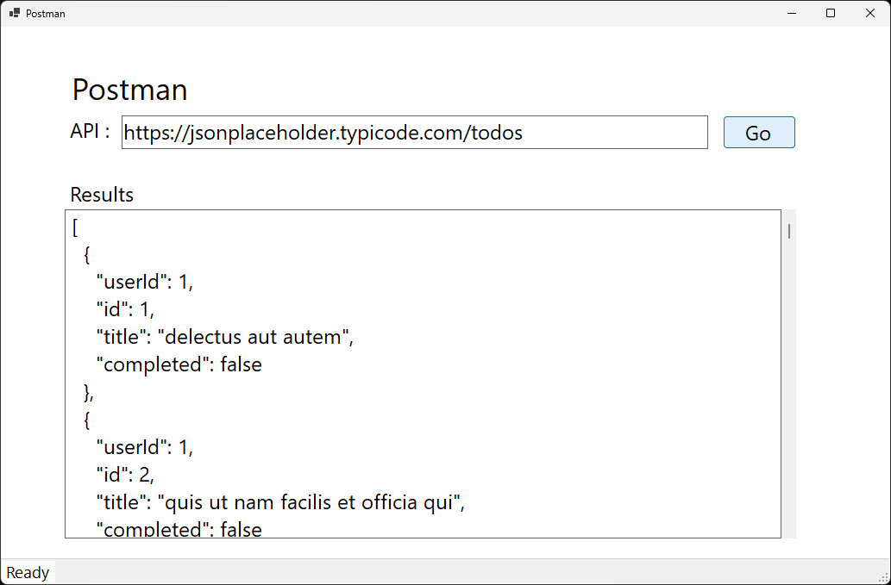

# Postman Clone

Postman Clone provides a user-friendly interface for making GET requests to APIs and viewing the responses in formatted JSON.
Ideal for developers and testers, this tool simplifies API interaction and debugging, helping you efficiently validate and troubleshoot your API calls.

## Technologies Used
* C#
* .NET 8
* WinForms
* HttpClient

## Using the App
1. Download the executable file from the release section.
2. When the application launches, it should look like this:

3. Fill in your API URL and hit GO:

## Upcoming Changes
* Adding POST, PUT, PATCH and DELETE functionality
* Adding API headers
* Handling API Authentication
* Adding Depecdency Injection
* Adding Logging
* Create a web-based user interface for the application
